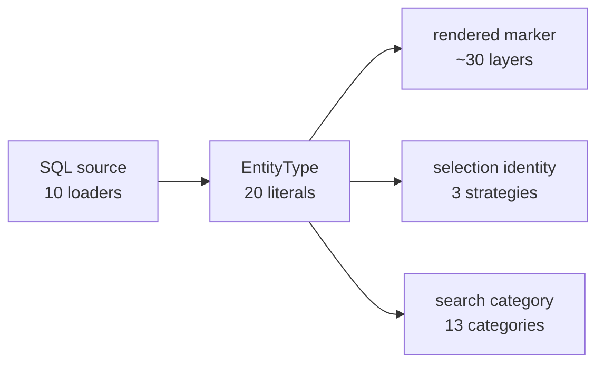
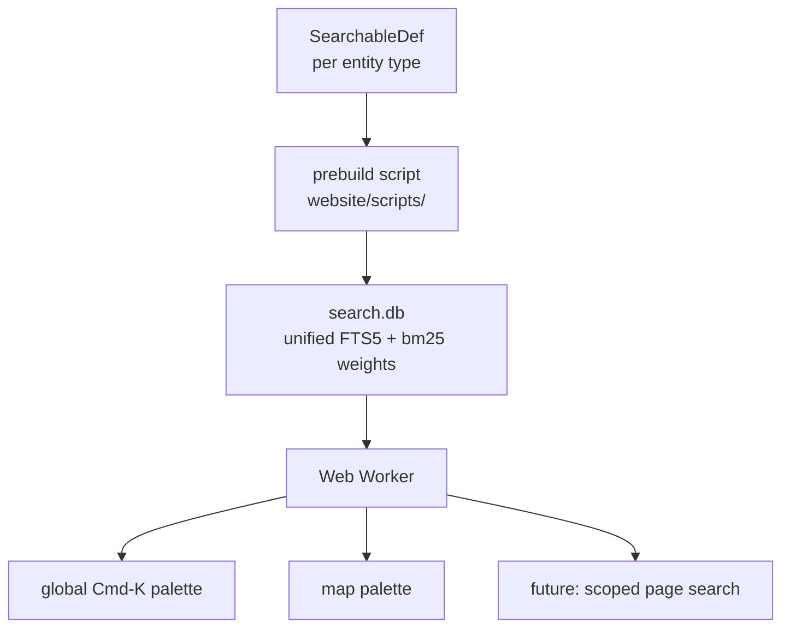

# Map Marker Registry, Wayfinding, and First-Class Search

**Status:** Requires review. Nothing implemented.
**Scope:** `website/` map subsystem, `website/` search (site-wide), and the pipeline
changes those require.

---

## 0. Provenance of every claim in this document

Prior planning documents were treated as **untrusted**. Every number below was
re-derived from source, from `website/static/compendium.db`, or from a primary external
document that was actually fetched. Where a prior document was wrong, that is recorded.

Three tiers are used throughout:

- **Measured** — a command was run; the script is in Appendix B.
- **Read** — quoted from source at `file:line`, or from an external URL.
- **[INFERENCE]** — reasoning, explicitly flagged.

### 0.1 Prior-document claims that are wrong

| Claim | Source | Reality (measured) |
| --- | --- | --- |
| "Monsters: ~10,000 … Gathering: ~5,000 … **Total: ~16,000 points**" | `website/src/lib/map/CLAUDE.md:188-194` | **4,360** monster spawns, **751** gathering spawns; **5,636** renderable points total. Off by ~3×. |
| "Full `compendium.db` … 16.1 MiB" used as the transfer cost | prior search plan | 16,949,248 B raw but **2,471,087 B gzip**. Compresses 6.9×. Any cost argument built on the raw figure is void. |
| "All 14 existing `*_fts` shadow tables — 1,396 KiB" | prior search plan | **1,429,504 B** via `dbstat`. Close, but re-measured. |
| Candidate search index "~1.4 MiB" | prior search plan | A cleaned unified full-content index is **502 KiB gzipped**; names+keywords only is **146 KiB**. |
| "`prefix='2,3'` … comma syntax is stale/likely invalid" | raised during research | **False.** Tested: `prefix='2,3'` and `prefix='2 3'` are both accepted and produce byte-identical indexes. The existing schema is correct. |
| Adding a marker touches "~20 files" | user's estimate; earlier draft said 21 sites | **33 distinct edit sites**, independently enumerated twice. The estimate was low. |
| "The zone graph has 3 components; Varensea Island and Trial of the Ancients are unreachable" | **an earlier draft of this document** | Wrong — it used `portals` alone. With NPC teleporters the graph is connected; with the **Evacuate** skill it is *strongly* connected (0/650 unreachable); with travel scrolls the diameter drops 6 → 3. See §1.6. |
| "25 ordered zone pairs are unreachable" | **a later draft of this document** | Also wrong — it modelled only mechanisms present in the database. `Evacuate` exists solely in `server-scripts/ZoneInfo.cs:208-258`. **Searching the data was not enough; the game logic had to be read.** |
| "Evacuate makes the graph strongly connected, so it is load-bearing" | **a third draft** | Misleading. `skills.player_classes` is `["wizard"]` — one class in six. The universal escape is the **Gate Scroll**, sold by 5 vendors, plus death. Routing must be class-blind; see `Availability` in §3.3. |
| "Old Valorath is a trap with no exit" | **a third draft** | Over-read. It has 5 spawns, 0 NPCs, 0 chests, 1 inbound and 0 outbound portals — **unreleased content**, visible only through data mining. Missing data, not design. |
| "All-pairs unreachability is the metric" | **all earlier drafts** | Wrong question. Leaving is always possible via bind point. The real question is inbound: **19 of 26 zones are one hop from a hub**, max 3, none unreachable. |
| "The 44 intra-zone portals are internal doors" | **a fourth draft** | Wrong framing. They span up to 339 units and connect named, key-gated sub-zones — they are teleporters like every other portal. All 118 portals carry sub-zone endpoints that resolve 100% cleanly, so the graph is **sub-zone granular** and the category disappears. See §1.6. |
| "The villages with no portal edge are reached by travel scroll" | **a fifth draft** | Wrong. **Towns are walkable parts of their parent zone**, not instances. Scrolls are a shortcut, not the access. `walk` is a fifth edge kind. |
| "`zone_triggers.is_outdoor` marks which sub-zones are walkable" | **a sixth draft** | Wrong. `is_outdoor` is an **environment flag** (it sits beside `bloom_color`, `light_intensity`, `audio_zone`). Thogh Maldur and Urord Nog are `is_outdoor = 0` yet walked into from the open world. The real rule is `zones.is_dungeon`, confirmed by intra-zone portals existing in **only** dungeon zones. See §1.6. |
| "The default view hides the map" | **a sixth draft** | Overstated. `tiles` supplies the map imagery; `parentZones`/`subZones` are debug/highlight bounding boxes, not visuals; `fabled` *is* on. Creatures and gathering are off deliberately — 3,972 + 751 markers would bury everything. Only Bug 4 (the `DEFAULT_LAYERS`/`fabled` mismatch) is real. See §1.4. |
| "Intra-zone portals exist only in dungeons, therefore the walk rule" | **a sixth draft** | True today, but an observation rather than a law. Now stated as a **guarded assumption** with a build-time test and a per-zone override, so a future patch fails loudly instead of producing wrong routes. See §1.6. |
| "Delete the all-arcs portal layer" | **a sixth draft** | Wrong reading of the intent. Showing all connections is a legitimate view; the *visualisation* is the problem. See §3.3 item 7. |
| "Deduplicate the 64 arcs down to 24 zone pairs" | **a seventh draft** | Wrong. **Portals are physical objects at distinct positions.** The six `Vault of the Vanished → Everfrost` portals are six exits on six different floors. Zone-pair dedup would erase five real map objects and draw the survivor from an arbitrary point. |
| "Filter arcs by focused zone" as the primary fix | **a seventh draft** | Wrong instinct. Zone focus is a modal filter the user must discover and then remember to leave, and on a spatial map it duplicates panning and zooming. Per the maintainer it is unused and not worth recommending. It is now a **deletion candidate** (§3.6), not a solution. |
| Portal distances of "317 / 88 / 365 units" | **several drafts** | Computed with `portals.position_z`, which is **0 for every row** — a dead column. The map uses `position_x`/`position_y` (`map.server.ts:187-188`), where game Z is stored in `position_y`. Corrected: intra-zone max 339 / mean 111, cross-zone mean 453 / max 1314. The qualitative conclusion held; the numbers did not. |
| `sqlite3-worker1-promiser` as the worker API | common advice | **Deprecated 2026-04-15** and actively discouraged — <https://sqlite.org/wasm/doc/trunk/api-worker1.md>. Do not build on it. |

### 0.2 What remains unverified

Stated plainly so nothing downstream silently assumes it:

- **`sql.js-fts5` WASM payload size.** No JS runtime (`node`/`bun`/`npm`) exists in this
  environment and the package is not vendored in a readable form. Prior docs said 1.2 MB;
  **unverified**. §7 gates on measuring it.
- **Any JS search-engine index size** (MiniSearch/Orama/Pagefind). Cannot be built here.
  §3.2 is deliberately designed so this does not gate the architecture.
- **Real cold-start latency** on throttled connections. Requires a browser.
- **Live map interaction** of the sibling Erenshor site — its DOM is JS-rendered and no
  browser was available; its *source* was read locally instead, which is stronger evidence.

---

## 1. Verified state

### 1.1 Adding one marker type costs 33 edit sites

Enumerated independently, twice, from source. "Edit site" = one closed list, switch
branch, or parallel data shape that must be extended.

| # | Location | Kind |
| ---: | --- | --- |
| 1 | `types/map.ts:6-26` `EntityType` union | mechanical |
| 2 | `types/map.ts:388-402` `MapEntityData` key | mechanical |
| 3 | `types/map.ts:406-425` `FilteredMapData` key | mechanical |
| 4 | `types/map.ts:293-342` `LayerVisibility` key | mechanical |
| 5 | `types/map.ts` new `*MapEntity` interface | **real** |
| 6 | `queries/map.server.ts` SQL loader + row mapping | **real** |
| 7 | `queries/map.server.ts:58-81` call + return wiring | mechanical |
| 8 | `map/zone-filter.ts:32-67` `ZoneFocusedData` + position filter | mechanical |
| 9 | `map/layers.ts:82-118` `createFilteredData` split | mechanical |
| 10 | `map/layers.ts:400-1360` layer declaration | mechanical |
| 11 | `map/layers.ts:1382-1430` return-array slot (paint order) | mechanical |
| 12 | `map/layers.ts:1092-1136` `getIconTypeKey` case | mechanical |
| 13–16 | `map/config.ts:39-63` `LAYER_COLORS`, `:70-84` `LAYER_RADII`, `:89-115` `ICON_SIZES`, `:256-270` `ENTITY_BORDER_COLORS` | mechanical |
| 17 | `map/icons.ts:40-70` `ENTITY_ICONS` | mechanical |
| 18–21 | `map/selection.ts:64-79` `EntityIndex`, `:154-183` populate, `:449-505` `getIndexForType`, `:270-285` `getIndexForCategory` | mechanical |
| 22–23 | `map/resolve-selection.ts:90-123` dispatch, `+` new resolver | mostly mechanical |
| 24–25 | `map/url-state.ts:41-100` defaults, `:180-270` URL conversion | mechanical |
| 26 | `map/visibility.ts:39-61` group key arrays (if grouped) | mechanical |
| 27–30 | `queries/map-search.ts:12-45` category union/order, `:84-109` fan-out, `:117-149` distribution, `+` new SQL block | mechanical + **real** |
| 31 | `components/map/MapSearch.svelte:62-76` label map | mechanical |
| 32 | `components/map/SearchResultItem.svelte:69-92` icon map | mechanical |
| 33 | `components/map/MapTooltip.svelte:52-106`, `EntityPopup.svelte:247-352`, `sidebar/MapSidebarContent.svelte`, `sidebar/MapSidebar.svelte`, `MapLink.svelte:5-20` | mechanical |

Exactly **two** are irreducible: the row interface and the SQL. The other 31 are
restatements of one fact in 31 dialects.

Scale confirming this: `LayerVisibility` has **46** keys; `createLayers()` takes **15**
positional parameters and returns **47** fixed layers plus **3** conditional patrol
layers; `config.ts` holds four parallel records of **19 / 12 / 21 / 20** keys;
`icons.ts` holds a fifth of **22**; `selection.ts` holds **13** index maps;
`resolve-selection.ts` has **11** resolvers behind **22** case labels.

`MapLink.svelte:5-20` declares a **second, independent** entity-type union that
disagrees with `EntityType` in both directions (it has `zone`/`item`/`quest`/`resource`,
which `EntityType` lacks; it lacks `boss`/`fabled`/`elite`/`hunt` and the gathering
variants, which `EntityType` has).

### 1.2 Three bugs, all produced by that duplication

**Bug 1 — wrong tooltip label.** `MapTooltip.svelte:101-105`:

```ts
case "chest":
case "treasure":
case "altar":
case "house":
  return "House";
```

Chests, treasure and altars are labelled "House".

**Bug 2 — wrong selection ring size.** `layers.ts:1092-1136` `getIconTypeKey()` has no
case for `gathering_fish`, `gathering_other` or `house`; all three fall to
`default: return "monster"`. `getRingRadius()` (`:1139-1143`) then sizes the highlight
ring from `ICON_SIZES.monster`. `ICON_SIZES` and `ENTITY_ICONS` both hold correct
entries — only the switch that maps into them is incomplete.

**Bug 3 — dead URL key.** `portalArcs` is declared (`types/map.ts:318`), defaulted
(`url-state.ts:87`), parsed and serialised (`:253`), and synced on toggle
(`visibility.ts:15-17`), but `layers.ts:739` renders arcs with `visibility.portals` and
no control exposes it. It occupies a slot in every shared URL and does nothing.

**Bug 4 — spurious URL parameter on every load.** `DEFAULT_LAYERS`
(`url-state.ts:36-47`) is exactly
`["bosses","elites","altars","traps","tiles","npcRenewalSages"]`, but
`getDefaultLayerVisibility()` (`:52-105`) additionally enables `fabled`. `buildUrl`
(`:340-348`) writes a `layers=` parameter whenever the active set differs from
`DEFAULT_LAYERS` — which it always does, from the first render. Every visitor gets a
noisy URL describing the default state.

### 1.3 What is actually on the map

Measured, per spawn table, positions non-null:

| Layer source | Points |
| --- | ---: |
| monster spawns | 4,360 — creature 3,972 / hunt 258 / elite 64 / boss 60 / world boss 6 |
| gathering spawns | 751 |
| npc spawns | 233 |
| chests | 128 |
| portals | 112 |
| traps | 27 |
| houses / treasure / altars | 9 / 9 / 7 |
| **Total** | **≈5,636** |

**This changes the design conclusion.** 5,636 points is nothing for deck.gl. The problem
was never throughput — it is **visual overlap and control complexity**. Any plan built on
"16,000 points, must virtualise" is solving a problem that does not exist.

### 1.4 The default view is deliberate; the URL handling of it is not

`getDefaultLayerVisibility()` enables 7 of 46 keys: `bosses`, `fabled`, `elites`,
`npcRenewalSages`, `altars`, `traps`, `tiles`. **This is a sound default and the plan
should not change it.** `tiles` supplies the actual map imagery; the enabled marker layers
are the sparse, high-value ones (137 boss/fabled/elite points, 7 altars, 27 traps). The
3,972 creature spawns and 751 gathering nodes are off precisely *because* drawing them all
would bury everything useful. `parentZones` and `subZones` are bounding boxes used for
debugging and for highlighting a selected zone — they are not the map's visuals, so their
being off by default costs nothing.

An earlier draft framed this as "the default view hides the map" and proposed turning
creatures and gathering on. That was wrong on both counts, and §3.4 no longer proposes it.

The one real defect here is **Bug 4** (§1.2): `DEFAULT_LAYERS` (`url-state.ts:36-47`) lists
six keys and omits `fabled`, while `getDefaultLayerVisibility()` enables it. `buildUrl`
(`:340-348`) writes a `layers=` parameter whenever the active set differs from
`DEFAULT_LAYERS`, so it always does — every visitor gets a URL restating the default. That
is URL noise, not a visibility problem, and the fix is to derive one list from the other.

The sidebar exposes **45 checkboxes** in 6 collapsible sections, 22 of them NPC roles
(`MapSidebarContent.svelte:89-229`). Collapsed, the quick rail
(`MapSidebar.svelte:382-463`) drops fabled, traps, houses, treasure, every individual NPC
role, all zone toggles, zone focus and both level filters. On mobile, all 45 controls live
behind one bottom drawer at `max-height: 85vh`.

Missing affordances, each verified absent by search: no legend, no coordinate readout, no
scale, no copy-permalink control, no reset-view control (`flyto.ts` implements
`resetView` but nothing calls it from the UI), no clustering or collision handling, no
keyboard navigation of the map, no screen-reader access to markers (the deck canvas is a
static `div` with an a11y ignore comment, `+page.svelte:1151-1163`).

### 1.5 Search: no global search, and the map's index is mostly markup

There is no site-wide search. `routes/+layout.svelte` has no palette.
`HomeSearch.svelte:1-4` is a visual-only stub behind `{#if dev}`.

`map-search.ts` runs 13 parallel category queries then **discards relevance**
(`:128-149`), interleaving round-robin by `SEARCH_CATEGORY_ORDER`. Match semantics are
inconsistent across those 13: eight match the whole FTS row
(`WHERE monsters_fts MATCH ?`, `:219`), four match only a name column
(`WHERE zf.name MATCH ?`, `:370`; chests `:486`; altars `:654`), and treasure
(`:596-598`) uses `LIKE '%…%'` with no FTS at all. Nothing anywhere calls `bm25()` — every
query uses bare `ORDER BY rank`, which weights all columns equally.

**The index is dominated by Unity rich-text markup.** `items_fts` is the largest FTS
table at 847,872 B (59% of all 1,429,504 B of FTS data). Its most frequent terms,
via `fts5vocab`:

| term | occurrences |
| --- | ---: |
| `color` | 14,984 |
| `a8b3b7` | 4,295 |
| `b` | 3,368 |
| `line` | 3,251 |
| `height` | 3,250 |
| `size` | 3,250 |
| `br` | 1,625 |
| `da4adc` | 950 |
| `healthbonus` | 719 |

Of 3,265 distinct terms, markup tags alone account for **30,487 occurrences**.
`a8b3b7` and `da4adc` are hex colour codes. `healthbonus` is an unresolved
`{HEALTHBONUS}` template placeholder. Measured markup share of the raw text:
**items 49%**, skills 30%, quests 14%.

The user-visible consequence, run against the live index:

| query | today's `items_fts`, `ORDER BY rank` |
| --- | --- |
| `color` | Glacierheart, Draconium Wyrmguard, Draconium Wyrmtreads, … |
| `size` | Arrow, Spider Egg, Water Bottle, Gem of Abundance, … |
| `healthbonus` | Sapphire Earring, Worn Leather Helm, Aged Golden Ring, … |

Those are not matches. They are markup. And because IDF is computed over this corpus,
the pollution degrades ranking for *legitimate* queries too.

Two further defects, found by running real queries against a rebuilt index: results are
**not deduplicated per entity** (`fishing` returns "Rough Fishing Spot" four times, once
per spawn row), and **portals have no name column at all**, so they surface as
`portal_everfrost_to_winterforge_1618028`.

Keyword coverage is thin. `keywords.py` generates keywords for 11 tables; `monsters`
receives a single word (`boss`, `hunt`), `chests` all receive the literal `'treasure'`,
`altars` all receive `'alter'` (deliberate — the comment at `:254` says "including common
typo"; the real word is still matched via `name`). `items`, `quests`, `skills` and `zones`
have **no** keywords column at all.

`sql.js` runs on the **main thread**: `db.ts:39-56` constructs the `Database` and every
`query()` does a synchronous `prepare`/`step` loop in the caller. There is no Worker.

### 1.6 Travel is seven mechanisms, and the database knows about four

**Portals alone are not the travel graph.** An earlier draft of this document built the
graph from `portals` only and concluded there were three components with two unreachable
zones. That was wrong twice over: it missed data in the database, and it missed mechanics
that exist **only in game code**. The complete enumeration, from a schema-wide search for
teleport/destination columns plus a read of `server-scripts/`:

| Mechanism | Source of truth | Cross-zone edges | In the DB? |
| --- | --- | ---: | --- |
| **Portals** (trigger) | `Portal.cs:9-62` / `portals` table | **47** | yes |
| **Portals** (click) | `InteractablePortal.cs:63-123` | — | partly — **different rules**, see below |
| **NPC teleporters** | `NpcTeleport.cs:4-39` / `npc_spawns.teleport_*` | **4** | yes |
| **Party teleport** | `TalindraNpc.cs:65-75` | quest-gated | **no** |
| **Travel scrolls** | `TravelItem.cs:11-46` / `items.travel_*` | **global** | destinations yes, rules no |
| **Evacuate skill** | `ZoneInfo.cs:208-258` | **21 (2 unique)** | **no — hardcoded in C#** |
| **Death → bind point** | `Player.cs:3388-3415` | player state | **no** |
| Trap teleports | `DangerousGround.cs:38-58` / `traps` | **0** | yes, all intra-zone |

**There are no dead ends, and "unreachable pairs" was the wrong metric.** Two earlier
drafts of this section computed all-pairs zone→zone reachability and reported 121, then
25, unreachable ordered pairs. Both were artefacts of the question, not facts about the
game. Nobody asks "how do I get from Skarr's Lair to Trolls Cave". Players ask **how do I
get *to* zone X**, from a city they are in or can trivially return to. Leaving is always
solved, by mechanisms that are not zone→zone edges at all:

| Escape | Availability | Evidence |
| --- | --- | --- |
| **Gate Scroll → bind point** | **sold by 5 vendors**, every class | `items.travel_destination_name = 'Bind Point'`; `TravelItem.cs:11-46` |
| **Death → bind point** | free, every class | `Player.cs:3388-3415` |
| Logout in Temple of Valaark | forced | `NetworkManagerMMO.cs:887-910` |
| **Evacuate** | **Wizard only** | `skills.player_classes = ["wizard"]` |

**Evacuate is not a universal escape.** It is `["wizard"]`, one of six classes
(warrior, ranger, cleric, rogue, wizard, druid), level 1, 300 mana, 300 s cooldown. Any
route step that says "cast Evacuate" is wrong for five sixths of players. The universal
equivalent is the Gate Scroll, which every class can buy from five vendors.

So the correct model is: **getting out is a footnote, getting in is the routing problem.**
Measured inbound reachability, starting from any of the five hubs, using only portals and
NPC teleporters:

| Distance from nearest hub | Zones |
| --- | --- |
| 0 (the hubs) | Twilight Forest, The Lone-lands, Everfrost, Crescent Coast, The Molten Summit |
| **1 hop** | **19 zones** — Abandoned Mines, Black Ice Deep, Crypt of Decay, Despair, Krom Razz, Lizardmen's Den, Lost Archives, Molten Sanctuary, Skarr's Lair, Sunken Temple, Temple of Valaark, The Forgotten Catacombs, The Twisted Haunt, Trial of the Ancients, Trolls Cave, Urord Nog Fortress, Varensea Island, Vault of the Vanished, Winterforge |
| 2 hops | Northern Wastes |
| 3 hops | Old Valorath |
| unreachable | **none** |

**Every zone is at most three hops from a hub, and 19 of 26 are exactly one.** That makes
the feature *easier* than the earlier framing implied: an itinerary is one to three lines,
not a six-step expedition.

**Old Valorath is unreleased content, not a designed trap.** An earlier draft made much of
it having no exit. Measured: 5 monster spawns, 0 NPCs, 0 chests, 1 inbound portal, 0
outbound, level range 52–54 — against Temple of Valaark's 345 spawns and 6 outbound
portals. It is work in progress that is visible through data mining. Its asymmetry is
missing data. The plan should not design around it; the routing UI should simply not
promise routes out of zones that have none, and the zone page should be able to mark a
zone unreleased.

**Temple of Valaark is not a trap either.** It has an open, unrequirement'd
`Temple of Valaark → Everfrost` portal. Entry needs a `draconic_key`; the three
`→ Vault of the Vanished` portals are closed and need `elemental_attunement`. The scroll
ban (`TravelItem.cs:11-46`) and the 5-occupant cap (`Player.cs:10357-10438`) are raid
design, not a dead end.

**The graph is sub-zone granular, and that removes a special case.** All 118 portals carry
`from_sub_zone_id` and `to_sub_zone_id`, and all 40 distinct values resolve to
`zone_triggers` with **zero unresolvable** — so sub-zone endpoints are not optional
metadata, they are the portal's real identity.

One caveat, measured: **4 of 112 portals sit outside the bounds of the sub-zone they
declare** as their origin. 96% clean is good enough to build on, but not good enough to
assume. The likely cause is that trigger bounds are 2D boxes over 3D spaces
[INFERENCE — not confirmed]. Phase 9 should report those four rather than silently trust
`from_sub_zone_id`, and the routing tests should pin the count so it cannot grow.

That reframes the 44 intra-zone portals. Calling them "doors" was wrong: measured
endpoint-to-endpoint distance runs to **339 units** (mean 111) against a cross-zone mean of
453, and they connect distinctly named places behind keys —
`Lizardmen's Den → The Scaled Sanctum`, `Despair Level 1 → Chamber of Fire`
(`emberseal_key`), `Vault of the Vanished 1st Floor → 2nd Floor` (`small_rusty_key`),
`Cinderbound Fields → Molten Sanctuary` (`ancient_key`). They are teleporters, the same
mechanism as every other portal, and `Portal.cs` treats them identically.

So model the graph over **sub-zones**, with zone routing as a projection of it. Then
intra-zone portals stop being a category at all — they are simply edges whose endpoints
share a parent zone. Measured sub-zone graph: 47 nodes, 70 open portal edges.

**Walking is the missing edge kind, and `zones.is_dungeon` is the rule.** Towns are not
separate instances — they are parts of a larger zone you simply walk into.

The supporting evidence is a clean split **in today's data**: intra-zone portals exist only
in dungeons — all 12 zones containing one have `is_dungeon = 1`, and no non-dungeon zone
has any. Overworld zones need none, because you walk.

**But that is an observation, not a law.** Nothing prevents a future patch from adding an
intra-zone portal to an overworld zone, or a walkable dungeon wing. So the walk rule must
be an **explicit, guarded assumption**, not an inference the code silently depends on:

- The `walk` provider derives edges from `is_dungeon = 0`, and a build-time test asserts
  the two conditions that make that sound — no intra-zone portal in a non-dungeon zone, and
  every dungeon's sub-zones reachable from its entrance through portals. If a patch breaks
  either, the build fails and a human decides, rather than the router quietly emitting
  wrong directions.
- `MarkerDef`'s sibling for places carries a per-zone **override**, so a future exception
  is one authored line rather than a rewrite of the rule.

| Parent zone | Sub-zones — all mutually walkable |
| --- | --- |
| Twilight Forest | Twilight Forest, Alaenanore Village |
| The Lone-lands | The Lone-Lands, Orc Village, King Vaeril's Bane, **Urord Nog** |
| Crescent Coast | Crescent Coast, Milldenn |
| The Molten Summit | Molten Summit, Bonebreach |
| Northern Wastes | Northern Wastes, Felarii Village |
| Everfrost | Everfrost, **Thogh Maldur** |
| Varensea Island | Varensea Island |
| every dungeon zone | portal-linked, never walkable |

**`is_outdoor` is not a connectivity flag — it is an environment flag**, and an earlier
draft of this section misread it. It sits in `zone_triggers` beside `bloom_color`,
`light_intensity` and `audio_zone`, and it marks whether an area renders as outdoors. The
two overworld sub-zones with `is_outdoor = 0` — **Thogh Maldur** (the dwarven village,
Everfrost) and **Urord Nog** (The Lone-lands) — are indoor *environments* that are
nonetheless walked into from the open world. Using it as the walkability rule wrongly
gated both behind portals that do not exist.

So the working rule — derived, guarded, and overridable — is: **within a non-dungeon zone,
every sub-zone is mutually reachable on foot at zero cost; within a dungeon, sub-zones are
portal-linked.** That yields 22 walk edges over the 15 overworld sub-zones today.

Beware the name collision this exposes: **Urord Nog** is a walkable sub-zone of The
Lone-lands; **Urord Nog Fortress** is a separate zone reached from it by portal in both
directions. Search and routing must not conflate them.

This also corrects a second earlier claim. The sub-zones with no portal edge were
explained away as travel-scroll and NPC-teleporter destinations. Wrong for five of them:
**Alaenanore Village, Bonebreach, Felarii Village, Orc Village and King Vaeril's Bane are
simply walkable.** Scrolls are a *shortcut* to three, not their access. Only Trial of the
Ancients and Varensea Island genuinely require a teleporter — with walk edges added, the
sub-zone graph has exactly those two as separate components.

**There are no walkable zone borders.** Re-tested using *all* 15 overworld triggers, not
just outdoor ones: no cross-zone pair of trigger bounds touches or overlaps. Zone-level
bounding boxes do overlap in places, but the trigger bounds — which are what
`ZoneTrigger.cs:71-105` actually uses to set `NetworkidZone` — do not. **The zone-level
results above therefore stand unchanged**: walking moves you within a zone, never between
them. Northern Wastes is a worked example — no border with Everfrost, so the route is
Everfrost → Winterforge → Northern Wastes, two hops through a dungeon, matching the
measured hop count.

This also fixes portal naming for free. §3.2 proposed synthesising `"<From> → <To>"` from
zone names, which yields `"The Twisted Haunt → The Twisted Haunt"` for 44 portals.
Sub-zone names give `"Vault of the Vanished: 1st Floor → 2nd Floor"`, which is both correct
and what a player would call it.

**Evacuate remains worth modelling, with the class caveat.**
`ZoneInfo.GetEvacuateIdZone` (`server-scripts/ZoneInfo.cs:208-247`) is a hardcoded switch
mapping all 26 numeric zone ids onto five non-dungeon hubs, with landing coordinates at
`:249-258`; `AreaBuffSkill.cs:124-131` invokes it and calls `TargetRpcPortal`. Verified:
nothing in `exported-data/` or `compendium.db` carries this mapping — a search for the
hub map and for the literal landing coordinates finds nothing, and
`SELECT … FROM sqlite_master WHERE lower(sql) LIKE '%evacuat%'` returns no rows. The
`skills` row for `evacuate` has `is_teleport = 1` and a tooltip, and no destination.

| Hub (non-dungeon) | Zones that evacuate to it |
| --- | --- |
| Twilight Forest | The Forgotten Catacombs, Lizardmen's Den, The Twisted Haunt, Trial of the Ancients |
| The Lone-lands | Despair, Abandoned Mines, Trolls Cave, Urord Nog Fortress |
| Everfrost | Black Ice Deep, Vault of the Vanished, Winterforge, Northern Wastes, Temple of Valaark, Old Valorath |
| Crescent Coast | Varensea Island, Lost Archives, Sunken Temple, Krom Razz |
| The Molten Summit | Crypt of Decay, Skarr's Lair, Molten Sanctuary |

All-pairs connectivity, recorded for completeness — but note that the last column is the
metric this section argues against, not the one the feature should optimise:

| Graph | Directed edges | Diameter | All-pairs unreachable |
| --- | ---: | ---: | ---: |
| A. portals only *(first error)* | 47 | 6 | 121 / 650 |
| B. + NPC teleporters *(second error)* | 51 | 6 | 25 / 650 |
| C. + Evacuate (Wizard only) | 53 | 6 | 0 / 650 |
| D. + travel scrolls | 153 | **3** | 0 / 650 |

Evacuate adds only two edges nothing else provides — `Northern Wastes → Everfrost` and
`Old Valorath → Everfrost`. The second is an artefact of unreleased content; the first is
real but redundant with the Gate Scroll for non-Wizards. So Evacuate is a **Wizard
convenience worth showing on the Wizard's route, and never the only answer**.

**Rules the database does not capture**, each read from game code:

- **Two portal code paths with different semantics.** `Portal.cs:9-62` (walk-in) checks,
  in order: alive and destination present → `isClosed` → `needMonsterDead` (evaluated as
  the monster's **live health > 0**, so it is dynamic server state, not a static flag) →
  key, satisfied by `player.keys.Contains(key.name)` *or* by a party member's key when
  `!requiresEveryoneKey` → `levelRequired` → `itemLevelRequired`.
  `InteractablePortal.cs:63-123` (click) is the same idea **without** `isClosed` and
  without `requiresEveryoneKey`. `requiresEveryoneKey` is not exported at all.
- **`isClosed` is permanent.** It is a serialized bool and no code path mutates it, so
  excluding closed portals from routing is correct. Eight are closed, including
  `Vault of the Vanished → Everfrost` and `Molten Sanctuary → Northern Wastes`.
- **Temple of Valaark (zone 23) is special-cased three times.**
  `Player.cs:10357-10438` refuses entry when population + mercenaries ≥ 5 — a capacity
  cap. `TravelItem.cs:11-46` refuses scroll use inside it. `Player.cs:5436-5445` forces a
  bind-point reset on logout there. None of this is in the database.
- **Travel scrolls are gated by more than ownership.** Charges (decremented unless
  infinite), a cooldown of 10, and `PlayerInventory.cs:1901-1918` blocks use while
  `remainingCombatStateTime > 0`. `Bind Point` is matched by literal destination **name**
  in `TravelItem.cs`, not by an id.
- **Party teleport is quest-gated.** `TalindraNpc.cs:65-75` requires the Trial of the
  Ancients quest and a party before `CmdTeleportParty`. So the Trial of the Ancients link
  is not simply a free teleporter, as the `npc_spawns` row alone suggests.
- **NPC teleport requires proximity and gold.** `NpcTeleport.cs:4-39` and
  `Player.cs:13296-13309`: state IDLE, alive, distance ≤ 2, `gold >= price`.
- **Bind points** are set at Soul Binder NPCs (`Npc.cs:42-45`, `Player.cs:9447-9454`) and
  are per-player state. Death returns the player there (`Player.cs:3388-3415`). Neither is
  routable — both are annotations.

**Join hazard, verified the hard way.** `zones` has *both* `id` (slug, `crescent_coast`)
and `zone_id` (numeric, `4`). `portals.from_zone_id` and `npc_spawns.teleport_zone_id`
reference `zones.id`; `zone_triggers.zone_id` references `zones.zone_id`, as does
`ZoneInfo.cs`. Joining the wrong one returns zero rows silently — it did exactly that
during this analysis. There are 47 `zone_triggers` across all 26 zones; they are
sub-zones and settlements, not alternate zone identities.

**Excluded zones are still routing nodes.** `constants.ts:1-9` excludes
`temple_of_valaark` and `old_valorath` from map display, but real routes pass through
both (Everfrost ↔ Temple of Valaark, Temple of Valaark ↔ Vault of the Vanished ×3,
Northern Wastes ↔ Old Valorath). Exclusion is a display decision, not a travel one.

**Diameter 6 (or 3) is still the whole insight.** Rendering the graph means 53 arcs.
Answering the actual question means rendering at most six.

### 1.7 Skills do have tooltips — answering the open question directly

Yes. `skills.tooltip_template`, **469 of 692 non-empty (68%)**, 89,592 B raw / 62,906 B
after stripping markup. It contains Unity rich text and `{PLACEHOLDER}` tokens:

```
<b>{NAME}</b>  <color=#32FF00>Lvl {LEVEL}</color>
{MANACOSTS} mana{CASTRANGE} yd range | {CASTTIME} cast  {COOLDOWN} cooldown
<color=#E0A613>Unleashes a divine aura that restores <b>{HEALSHEALTH}</b>…</color>
```

So skills need **both**: strip the markup, and **drop** the placeholders — the same
treatment items and quests need.

**Drop, not resolve** — measured, and this simplifies Phase 7 considerably. There are
**53 distinct placeholders**, led by `{BUFFTIME}` (313 uses), `{COOLDOWN}` (174),
`{CASTTIME}` (157) and `{MANACOSTS}` (118). Only a handful map directly onto a column
name; the rest need a hand-written mapping table, and the target columns hold JSON like
`{"base_value": 300, "bonus_per_level": 0}`, so a real value also needs a level to
evaluate at. That is a rendering feature, not an indexing one. **For search, the prose
between the placeholders is the searchable content** — "unleashes a divine aura that
restores health" — and nobody queries "300 mana". Strip them and index the prose.
Resolving them for display on skill pages is a separate feature and out of scope here. Skills also carry `skill_aggro_message`, `damage_type`,
`buff_category` and `player_classes`, which are good keyword material. No renderer that
converts `tooltip_template` into prose was found under `website/src/lib` (only the type
declaration at `types/skills.ts:53`), so **the placeholder resolution has to be written**;
it cannot be borrowed. 223 skills have no tooltip and must rely on name + generated
keywords.

---

## 2. Root cause

`EntityType` is asked to be three things whose cardinalities do not match.



- One source, five types — the monster loader emits `monster|boss|fabled|elite|hunt`.
- One type, two markers — `crafting_station` renders as forge or cooking oven depending on
  `isCookingOven`, which is why `cooking_oven` exists as an icon key but not an
  `EntityType`.
- One type, twenty-two toggles — `npc` is one layer behind a 22-bit GPU mask
  (`layers.ts:129-153`).
- Four namespaces for one concept — `gathering_plant` (`EntityType`) → `gathering`
  (`MapEntityData`) → `plants` (`FilteredMapData`) → `gatheringPlants`
  (`LayerVisibility`) → `resource` (`MapSearchCategory`).

Every mismatch is a hand-written translation, and every hand-written translation is where
Bugs 1–4 live.

The sibling Erenshor project documents the same class of failure from the other end.
`erenshor-data-mining/docs/architecture-analysis.md:101-106` records that its
`mapping.json` registry is consumed only by the Python wiki path, while "map and sheets
never see it" and "consumers patch independently". **A registry that only one consumer
reads is not a registry.** Ours must serve the map, search, links and detail pages, or it
will reproduce that flaw.

---

## 3. What to build

Four things, in dependency order. The registry is the spine; the other three are what it
makes cheap.

### 3.1 Marker registry

Split the three conflated concepts into three declarations.

```
src/lib/entities/<entity>/definition.ts     shared   identity: kind, label, route
src/lib/entities/<entity>/markers.ts        shared   one MarkerDef per rendered layer
src/lib/entities/<entity>/search.ts         shared   one SearchableDef (§3.2)
src/lib/entities/<entity>/popup.svelte      browser  popup body, only if it has fields
src/lib/server/entities/<entity>/map.ts     server   the SQL loader
```

```ts
export interface MarkerDef<TRow extends MapRow = MapRow> {
  id: MarkerId;                        // deck.gl layer id AND URL visibility token
  source: SourceId;                    // which server loader supplies rows
  match: (row: TRow) => boolean;       // which of that source's rows are this marker

  // Presentation. Replaces LAYER_COLORS / LAYER_RADII / ICON_SIZES /
  // ENTITY_BORDER_COLORS / ENTITY_ICONS, which then cannot drift apart.
  label: string;
  pluralLabel: string;
  color: RGB;
  icon: IconNode;
  iconSize: { base: number; min: number; max: number };
  fallbackRadius: number;
  borderClass: string;

  // Placement in UI and in the paint order
  section: SidebarSection;
  order: number;
  z: number;                           // explicit: deck.gl array order IS paint order
  defaultVisible: boolean;
  quickToggle?: boolean;

  // Behaviour
  selection: SelectionStrategy<TRow>;
  href?: (row: TRow) => string | null;
  displayName?: (row: TRow) => string;
  popup?: Component<{ row: TRow }>;
  decorations?: (ctx: DecorationContext<TRow>) => Layer[];
  facets?: FacetDef<TRow>[];           // NPC roles, see below
}

export type SelectionStrategy<TRow> =
  | { kind: "by-id" }
  | { kind: "by-field"; field: (row: TRow) => string }   // monsterId
  | { kind: "by-group"; group: (row: TRow) => string }   // selectionGroupId
  | { kind: "delegated"; resolve: (row: TRow) => SelectionTarget };
```

Types are **derived from** the registry, never declared alongside it:

```ts
export const markers = { … } satisfies Record<string, MarkerDef>;
export type MarkerId = keyof typeof markers;
export type LayerVisibility = Record<MarkerId, boolean>;
```

`satisfies` checks the shape without widening the value, so per-entry literal types
survive for inference — <https://www.typescriptlang.org/docs/handbook/release-notes/typescript-4-9.html>.

**Explicit imports, not `import.meta.glob`.** Vite's glob import is lazy by default
(returns promises, unusable for synchronous layer construction), `eager: true` pulls every
module into the prerender graph, and it provides no type inference because Vite transpiles
without type-checking — <https://vite.dev/guide/features.html#glob-import>. Cost: one
import line per entity in three barrels. Bought back by a completeness test (§6) that
fails the build when a marker module exists but is not imported.

**Runtime split** is enforced by SvelteKit: server loaders live under `$lib/server`, whose
import into browser code is rejected at build time —
<https://svelte.dev/docs/kit/server-only-modules>.

Deck.gl constraints the generated layers must respect, from primary sources:

- **Stable ids.** "The `id` must be unique among all your layers at a given time"; ids
  match layers between renders — <https://deck.gl/docs/api-reference/core/layer>.
  `MarkerDef.id` is the layer id. Id churn destroys and reinitialises GPU state.
- **`visible: false`, never omission.** Omitting a layer means its "state will be
  destroyed and regenerated every time" the flag changes (same doc).
- **Hoisted accessors.** `comparePropValues` in
  `deck.gl/modules/core/src/lifecycle/props.ts` falls through to `!==` for functions, so a
  freshly allocated closure reads as a changed prop. Accessors are built once at registry
  init and stored on the def.
- **Shared extension instances.** `diffExtensions` identity-checks the array, then each
  instance's `.equals`. The `DataFilterExtension` instances stay module singletons.

**Escape hatches**, each narrow, each with a stated failure mode:

| Hook | For | Failure mode | Guard |
| --- | --- | --- | --- |
| `decorations()` | patrol paths, portal/teleporter/trap arcs, altar radius, trap area, relation arcs | bespoke layers escape id/z/visibility discipline | ids must be prefixed with the marker id; asserted in test 5 |
| `popup` | the 10 per-type popup bodies (monster 248 lines, NPC 150, altar 133, gathering 112) | popups reach back into global map state | props are `{ row }` only |
| `selection: delegated` | altar-only monsters | arbitrary resolution rebuilds the switch inside the def | must return a `SelectionTarget`, never a popup |
| `facets` | the 22 NPC roles | 22 markers with identical rendering would be a worse lie | one layer, one GPU mask, facets derive the UI and URL keys |

Precedent for narrow-override-on-a-common-path: deck.gl's `MVTLayer` inherits all tile and
picking machinery and exposes only `renderSubLayers`, with a runtime warning when an
override breaks the base contract
(`modules/geo-layers/src/mvt-layer/mvt-layer.ts:286-300`). The warning is the point — an
escape hatch without an assertion is where behaviour diverges silently.

### 3.2 Search as a first-class capability

One capability, three consumers, one index.



```ts
export interface SearchableDef {
  type: SearchTypeId;
  label: string;                          // group heading, from the entity definition
  icon: IconNode;                         // from the entity definition
  order: number;
  href: (id: string) => string;
  mapTargets?: MarkerId[];                // if it can be revealed on the map
  index: (db: Database) => SearchDoc[];   // build-time only
}

interface SearchDoc {
  entityId: string;
  name: string;                           // never null — synthesise for portals
  keywords: string;
  content: string;                        // stripped of markup and placeholders
}
```

Registering a type deletes: `MapSearchCategory`, `SEARCH_CATEGORY_ORDER`,
`resultsByCategory`, the 13-way fan-out, the round-robin interleave, the label map in
`MapSearch.svelte:62-76`, and the icon map in `SearchResultItem.svelte:69-92`. It also
removes the reason `SearchResultItem.svelte:35-59` duplicates `RoleBadges.svelte:26-59`.

**Six decisions, each backed by a measurement or a primary source.**

**(a) Clean the text before indexing.** Strip Unity rich-text tags and `{PLACEHOLDER}`
tokens. This is not cosmetic: it removes 30,487 junk term occurrences, deletes `color`
(14,984) and two hex codes from the vocabulary, and repairs IDF for every real query.
Measured effect on corpus: items 582,079 → 300,016 B.

**(b) One unified index, not 14.** bm25 is only comparable within a single index, so a
single ranked list — which a palette needs and round-robin fakes — requires one table.
Measured: one row per entity (3,601 rows), external-content FTS5, `optimize`, `VACUUM`:

| Variant | raw | gzip |
| --- | ---: | ---: |
| name + keywords, `prefix='2 3'` | 434,176 B | **148,999 B (146 KiB)** |
| + stripped content | 1,523,712 B | **513,835 B (502 KiB)** |
| + stripped content, `tokenize='trigram'` | 2,588,672 B | 1,041,396 B (1017 KiB) |

The full-content unified index at 502 KiB gzip is **smaller than the 1,429,504 B of
per-table FTS we already ship**, and it covers skills, which today have no FTS table at
all. Trigram costs 2× for substring tolerance that §(e) achieves for free.

**(c) Ship it as its own artifact, built by a Node prebuild script.** Not inside
`compendium.db`. Search must answer a keystroke on any page; forcing a 2.36 MB download to
do that is the wrong trade when 502 KiB suffices. The script lives in `website/scripts/`
and joins the existing `prebuild` chain — verified to exist:
`"prebuild": "node scripts/generate-og-image.mjs && node scripts/generate-home-counts.mjs && node scripts/build-sitemap-manifest.mjs"`,
and `generate-home-counts.mjs:19` already uses `better-sqlite3` with a header explaining
that Workers cannot.

**One hard constraint the existing scripts do not yet face.** Every current build script is
self-contained — **none imports from `src/lib`** (verified). The search-index builder would
be the first, and it must run outside Vite, so it can load `.ts` via `tsx` (already a
devDependency, `^4.23.1`) but **cannot load `.svelte` at all**. Therefore:

> `SearchableDef` modules, and everything they transitively import, must be free of Svelte
> components.

That is why `search.ts` is a separate module from `markers.ts` rather than a field on
`MarkerDef`: the marker registry legitimately holds `popup?: Component`, and entangling the
two would make the index unbuildable. A test should assert the search registry's import
graph contains no `.svelte` file, because the failure mode otherwise appears only at build
time in CI. **The registry must own the document list**; if Python owned it,
adding a searchable entity would mean editing two languages and the registry would stop
being the single source of truth — precisely the Erenshor flaw cited in §2. Python's
remaining search job is producing source columns (`keywords.py`).

**(d) Query it in a Web Worker.** `db.ts:39-56` runs synchronously on the main thread
today; a full-text query over a 17 MB in-memory DB during keystrokes is a jank source. Use
a plain Worker with a small typed RPC. **Do not** adopt `sqlite3-worker1-promiser`: it was
deprecated 2026-04-15 and is "actively discouraged" —
<https://sqlite.org/wasm/doc/trunk/api-worker1.md>. OPFS is not needed and carries
COOP/COEP requirements and a Safari <17 incompatibility —
<https://sqlite.org/wasm/doc/trunk/persistence.md>.

**(e) Tiered matching, with fuzzy as a cheap fallback.** FTS5 has no fuzzy operator. The
tiers, in order: exact name → name prefix → FTS content match ranked by
`bm25(search_fts, 10.0, 5.0, 1.0)` → **fuzzy over names only** when the previous tiers
return nothing. The name list is small (146 KiB index; the raw names are far less), so
typo tolerance costs almost nothing and avoids the 2× trigram penalty. This is exactly
what the sibling project settled on independently:
`erenshor-data-mining/src/maps/src/lib/map/search/fuse-index.ts:73-130` — exact prefix,
then substring, then Fuse fuzzy only when exact matching returns nothing.

FTS5 syntax, quoted from <https://sqlite.org/fts5.html>:
`ORDER BY bm25(email, 10.0, 5.0)` for column weights;
`prefix='2 3'`; `tokenize='unicode61 remove_diacritics 1'`;
`highlight(ft, 0, '<b>', '</b>')` and `snippet(...)` for showing **why** a result matched;
`fts5vocab` for auditing the vocabulary (which is how §1.5 was measured — keep it as a
build-time assertion).

Reject `porter` stemming: game entity names are proper nouns and stemming corrupts them.

**(f) One row per entity, and every row has a name.** Dedup at index time — verified need
from `fishing` returning one row per spawn. Synthesise names where the source has none:
portals become `"<From Sub-zone> → <To Sub-zone>"` — sub-zone, not zone, because zone names
collapse 44 of the 118 to `"X → X"` (§1.6). This also fixes their display in results and,
usefully, in the wayfinding itinerary (§3.3).

Because the index is unified, **reciprocal rank fusion is not needed**. RRF
(Cormack et al., <https://doi.org/10.1145/1571941.1572114>) exists to merge rankings from
incomparable corpora; unifying removes the incomparability rather than papering over it.
It stays the documented fallback if per-type indexes ever return.

**UX**, per <https://www.w3.org/WAI/ARIA/apg/patterns/combobox/>: `role="combobox"` with
`aria-expanded`, `aria-controls`, `aria-activedescendant`; Enter accepts, Escape closes and
restores focus. Cmd/Ctrl-K from every route. 150 ms debounce and a 2-character minimum,
matching both `MapSearch.svelte:32-46` here and `MapSearch.svelte:50-106` in the sibling
project. Group by type, cap 3–5 per group, but rank globally within that. Show a
`snippet()` so the match is explainable. Empty query renders nothing; no match renders
`CommandEmpty`.

### 3.3 Wayfinding — the answer to the portal problem

**The problem, restated from the data.** Arcs are off by default because 51 of them
obliterate the map. But the recurring Discord question — "how do I get to zone X?" — is
exactly what they were meant to answer. Turning them on answers "show me the whole graph"
when the question is "show me one path".

**And the answer is short.** Measured in §1.6: 19 of 26 zones are **one hop** from a hub,
one is two, one is three, none unreachable. Rendering all 51 arcs answers a question
nobody asked; rendering one to three answers the real one.

**Travel is a registry, not a table.** §1.6 found seven mechanisms with three different
edge shapes plus class and item gates, and more are clearly coming. Hard-coding "portals"
would repeat the mistake this whole document exists to fix. So travel edges are
contributed the same way markers and search documents are:

```ts
export interface TravelEdgeProvider {
  id: TravelKind;                       // "portal" | "npc_teleport" | "travel_item" | …
  label: string;                        // "Portal", "Teleporter", "Scroll"
  /** Build-time. Emits edges of exactly one shape. */
  edges: (db: Database) => TravelEdge[];
}

export type TravelEdge =
  /** Walk. Zero cost, no gate, always available. Derived, not authored. */
  | { kind: "walk";   from: PlaceId; to: PlaceId }
  | { kind: "fixed";  from: PlaceId; to: PlaceId; via: EdgeRef; availability: Availability;
      cost?: number; requires?: Requirement[] }
  /** Usable from anywhere, gated on possessing something. */
  | { kind: "global"; to: PlaceId;  via: EdgeRef; availability: Availability;
      requires: Requirement[] }
  /** Destination is player state; cannot be routed, only annotated. */
  | { kind: "unroutable"; via: EdgeRef; note: string };

/** Who can actually use this edge. Drives the every-class rule below. */
export type Availability =
  | { to: "everyone" }
  | { to: "classes"; classes: ClassId[] }   // Evacuate -> ["wizard"]
  | { to: "holders"; item: ItemId }         // travel scrolls
  | { to: "quest";   quest: QuestId };      // Trial of the Ancients party teleport
```

`Availability` is the field that keeps the routing honest, and it exists because the data
demanded it: Evacuate is `["wizard"]`, scrolls need the item, the Trial of the Ancients
teleport needs a quest and a party. A router without it will confidently tell a Warrior to
cast a Wizard spell.

**Nodes are sub-zones, not zones** (§1.6). All 118 portals resolve cleanly to
`zone_triggers` endpoints, so nodes are `PlaceId` (sub-zone) throughout and zone-level routing
is a projection: collapse each sub-zone to its parent, drop self-loops. This is why there
is no "intra-zone portal" case anywhere in the model — those are just edges whose endpoints
share a parent. It also means the router can answer "how do I get to the Chamber of Fire",
which is the granularity players actually name.

Five providers on day one. **`walk` comes first**, because it is the only one that is
purely derived: for each zone where `is_dungeon = 0`, connect every sub-zone to every
other, both directions, zero cost, no gate — 22 edges. That is what makes Alaenanore
Village reachable without inventing a scroll requirement, and Thogh Maldur reachable
without inventing a portal. Then `portals` (110 open edges over 47 sub-zone nodes),
`npc_teleport` (4, priced, one quest-gated), `evacuate` (21, Wizard-only) and
`travel_item` (5 global + 1 unroutable). Only the 6 trap teleports contribute nothing:
they land in the same sub-zone and are pure in-place movement, so they stay map markers.
Death-to-bind-point and the login/logout fallbacks (`NetworkManagerMMO.cs:439-500,
887-910`) are player state, so they are `unroutable` annotations.

**The `evacuate` provider needs a pipeline change, because its data does not exist yet.**
`ZoneInfo.cs:208-258` is decompiled C#, not exported. The repo already has the right
machinery for this: values transcribed from `server-scripts/` are pinned by
`citations.lock.json` and checked by `build-pipeline/src/compendium/commands/citations.py`,
which fails when the cited region's hash drifts. So:

1. Add an `evacuate_destinations` table — `source_zone_id`, `destination_zone_id`
   (both the **numeric** `zones.zone_id`), `destination_x`, `destination_y`.
2. Populate it in the pipeline from a transcription of the switch, each value carrying
   `# Source: server-scripts/ZoneInfo.cs:208-247` and `:249-258`.
3. The citation checker then makes a game patch that changes the hub map a **build
   failure** rather than a silently wrong route.

This is the only place in this plan where the compendium must transcribe game logic rather
than read exported data, and it is worth it: those 21 edges are the difference between "25
zone pairs look unreachable" and "every zone pair has an answer".

**Design.**

1. **Build time.** Collect edges from every provider, filter to those with
   `availability.to === "everyone"` for the baseline, then compute shortest paths. Emit a
   `zone_routes` artifact from the same prebuild script that builds the search index.
   **Directed**, because the graph is genuinely asymmetric — six portal pairs have no
   reverse. All-pairs is 650 routes and hub-to-zone is 130; both are trivial to compute, so
   emit both and let the UI default to the hub view.
2. **Route inbound from hubs, not all-pairs.** The question is "how do I get to X", and
   the answer is short: 19 of 26 zones are one hop from a hub, one is two, one is three,
   none are unreachable. So the primary artifact is **hub → zone**, 5 × 26 = 130 routes,
   and the itinerary is one to three lines. Offer an origin override for the rarer
   "I'm already in Y" case, but do not make the common answer pay for it.
   "Getting out" is not routed at all — it is a standing note on every zone page: *Gate
   Scroll returns you to your bind point; so does dying.*
3. **Class-aware steps, not class-blind ones.** Evacuate is Wizard-only. A route step that
   says "cast Evacuate" is wrong for five of six classes. Rule: **every route must be
   completable by every class**; class- or item-specific shortcuts appear as an optional
   annotation on the hop ("Wizard: Evacuate returns you here"), never as the only path.
   The same applies to scroll shortcuts, which need the scroll in inventory.
4. **Zone detail pages get a prerendered "How to get here" section.** Static HTML, no
   JavaScript, therefore indexable — so search engines answer the Discord question before
   anyone reaches Discord. This is the larger half of the value and it does not touch the
   map. Group hops **by travel method**, following the OSRS wiki's shape. Facts that
   currently exist nowhere on the site and would first appear here: Varensea Island and
   Trial of the Ancients are reachable only by NPC teleporter; the Trial of the Ancients
   teleport additionally requires the quest **and** a party (`TalindraNpc.cs:65-75`);
   Temple of Valaark refuses entry at 5 occupants and blocks scroll use, so the way out is
   its open Everfrost portal or logging out (`Player.cs:10357-10438`,
   `TravelItem.cs:11-46`, `NetworkManagerMMO.cs:887-910`).
   **Excluded zones stay in the graph.** `constants.ts:1-9` hides `temple_of_valaark` and
   `old_valorath` from the map, but real routes pass through both. Exclusion is a display
   decision; dropping them as routing nodes would lose valid routes.
5. **Requirements are first-class, and the DB does not hold all of them.** 28 portals
   require an item, 9 an item level, 8 a monster dead, 6 a character level; two teleporters
   cost 25 gold and need the player within 2 units (`NpcTeleport.cs:4-39`). Every hop shows
   its gate. Three semantics come only from code and must be reflected, not guessed:
   `needMonsterDead` is evaluated against the monster's **live health**
   (`Portal.cs:9-62`), so it is server state rather than a static flag; a portal key may be
   satisfied by a **party member** when `requiresEveryoneKey` is false — a field that is
   not exported at all; and the click path `InteractablePortal.cs:63-123` omits the
   `isClosed` and `requiresEveryoneKey` checks the walk-in path applies, so the same
   conceptual portal has two rule sets. Where the compendium cannot be certain, it should
   state the requirement and not imply the route is guaranteed.
   `isClosed` **is** permanent — a serialized bool with no mutating code path — so
   excluding the 8 closed portals from routing is correct.
6. **The map gets a route mode.** Choose a destination (from search, a zone click, or a
   zone-page link) and optionally an origin. Render **only** the route: numbered hops, with
   the itinerary in a panel. Global scroll edges render as a badge on the itinerary rather
   than an arc, since they have no origin point to draw from.
7. **Keep the all-arcs layer, and fix its rendering — without deleting portals.**
   Showing every connection is a legitimate thing to want; the *visualisation* is what
   makes it unusable.

   **Deduplication by zone pair is not available and an earlier draft was wrong to propose
   it.** Portals are physical objects at distinct positions. The six
   `Vault of the Vanished → Everfrost` portals are six separate exits — Basement, 1st, 2nd,
   4th (×2) and 5th floor — at six different coordinates. Collapsing them to one arc would
   erase five real map objects and draw the survivor from an arbitrary point. Every arc has
   a real source and a real destination, and both must stay.

   What the geometry actually says (measured on `position_x`/`position_y`):

   | | count | min | mean | max |
   | --- | ---: | ---: | ---: | ---: |
   | cross-zone, open | 61 | 35 | **453** | 1314 |
   | intra-zone, open | 44 | 7 | 111 | 339 |

   Against a world spanning roughly 1680 × 1920, the average cross-zone arc crosses a
   quarter of the map and the longest crosses two-thirds. **That is the clutter: 61 long
   straight lines drawn over everything at once.** The 44 intra-zone arcs are short and
   local and are not the problem.

   Options that reduce noise without discarding data, in rough order of expected value:

   - **`ArcLayer` instead of `LineLayer`.** Curvature separates parallel and crossing
     links that straight segments merge into a mesh, and the source/target colour gradient
     encodes direction — which matters, since six pairs are one-way. This is the only
     option that attacks the actual cause: 61 straight chords over one plane.
   - **Low default opacity with emphasis on hover and selection.** The standard mitigation
     for a graph hairball: draw the whole set faint, bring one connection to full strength
     when the user points at either endpoint. Requires no new mode and no new control, and
     the hover plumbing already exists.
   - **Separate the two populations.** Cross-zone (world travel, mean 453) and intra-zone
     (in-dungeon navigation, mean 111) answer different questions at different scales and
     need not share one toggle.

   **Not zone focus.** An earlier draft made filtering by `focusedZoneId` the primary
   recommendation. It is the wrong instinct twice over: it answers a rendering problem with
   a modal filter the user must first discover and then remember to leave, and on a spatial
   map it duplicates what panning and zooming already do. The feature is also a deletion
   candidate in its own right (§3.6).

   **This needs visual iteration, not a decreed fix.** I have not seen the current layer
   rendered, so the ordering above is reasoning from geometry, not from observation. The
   registry's job is to make trying each of these a change to one `decorations()` hook
   rather than an edit to `layers.ts`, `config.ts` and three components.

   Bug 3 is still fixed, but by wiring rather than deletion: `portalArcs` becomes the real
   visibility key for this layer instead of a parsed-and-ignored one. Per the decision that
   arcs are not independently toggleable from portals, it stays synced to `portals`
   (`visibility.ts:15-17`) and does not get its own checkbox — it simply stops being dead
   state in the URL.
8. **Teleporter NPCs become routing-visible.** The four cross-zone teleport edges live on
   `npc_spawns`, so the NPC marker's popup should state the destination and price, and the
   itinerary should name the NPC ("Talindra Norqirelle, free"). Today `npcTeleporters` is
   one of 22 role toggles and the teleport arcs are gated behind it — that is the wrong
   home for the only link to two zones.

**Honesty about precedent.** The sibling Erenshor map does **not** do this. Its "Travel"
section renders zone connections as source→destination lines plus a destination dot
(`src/maps/src/lib/map/layers.ts:398-474`) and its popup reports only destination and
enemy levels (`ZoneLinePopupContent.svelte:16-44`) — visual links, no pathfinding. The
closest external precedent is the OSRS wiki's Transportation page
(<https://oldschool.runescape.wiki/w/Transportation>), which answers travel questions as
**method-grouped tables of destinations and requirements** rather than a rendered graph —
i.e. as an itinerary, which is what item 3 above builds. Its grouping *by travel method*
is also the right shape for the zone-page section, since our mechanisms have
genuinely different requirements.

### 3.4 Layer control at scale

45 checkboxes is the symptom; the registry is what makes the cure cheap, since sections,
order, labels, colours and icons all come from `MarkerDef`.

- **Model the 22 NPC roles as `facets` in the registry, but keep the current UI.**
  To answer the question directly: by "facet control" I meant replacing the 22 checkboxes
  with a single row — `NPC roles: [Vendors ×] [Quest Givers ×] [+20 more ▾]` — opening a
  searchable multi-select popover, the pattern shadcn/bits-ui calls a faceted filter and
  which this repo already ships in `data-table/data-table-faceted-filter.svelte`.
  **Having described it, I withdraw the recommendation.** It moves 22 rows behind a click
  and introduces a second selection idiom, in exchange for a section that is already
  collapsible with an all-toggle. That does not clear the bar.
  The registry change is still worth making: `facets` means the 22 keys, their labels,
  icons and bitmask positions are declared once on the NPC marker and the existing
  checkbox section is *generated* from them, instead of being hand-maintained in
  `MapSidebarContent.svelte:89-229`, `MapSidebar.svelte`, `url-state.ts` and
  `layers.ts:129-153` separately. Same UI, one source.
- **Fix Bug 4** by deriving `DEFAULT_LAYERS` from
  `markers.filter(m => m.defaultVisible)` so the two lists cannot disagree and the URL
  stops restating the default on every load.

**Three things an earlier draft proposed here are withdrawn**, recorded so they are not
re-proposed later:

| Withdrawn | Why |
| --- | --- |
| Named presets ("Levelling", "Gathering", "Bosses") | Preferences differ per player; a preset list is more surface to maintain and explain for little benefit over the existing section toggles |
| Creatures and gathering on by default | 3,972 + 751 markers bury everything useful. The current default is deliberate — see §1.4 |
| Short URL layer tokens | Makes shared links unreadable, and breaks every existing link, to save bytes nobody is counting |

The registry still earns its keep here without any of them: sections, order, labels,
colours, icons, defaults and URL keys all come from one `MarkerDef` instead of being
restated across `MapSidebarContent.svelte`, `MapSidebar.svelte`, `url-state.ts` and
`config.ts`. That removes edit sites and the Bug 1/2/4 class, and changes nothing the user
sees.

### 3.5 Rendering — one real problem, and two non-problems

**Marker rendering is fine.** 5,636 points is nothing for deck.gl, the layer defaults
already keep the map sparse (§1.4), and no evidence was found of a density complaint.

Two mechanisms an earlier draft proposed here are **withdrawn**:

| Withdrawn | Why |
| --- | --- |
| `CollisionFilterExtension` to hide overlapping markers | Solves a problem the current rendering does not have. It was proposed to support a denser default view, which is itself withdrawn |
| `pickMultipleObjects` "overlapping markers" list on click | Costs every user an extra click to fix a case Ancient Kingdoms largely does not have — markers here are not stacked at identical coordinates the way the sibling project's are. It is the weaker part of that project's UX, not a pattern to copy |

**The one genuine rendering problem is the portal arcs**, and §3.3 item 7 handles it:
61 open cross-zone arcs average 453 units across a ~1680 x 1920 world, so they blanket the
map. The fixes are zone-focus filtering, `ArcLayer` curvature, and lower default visual
weight — changes to *how* one layer draws, not a new subsystem, and not a reduction in the
number of portals shown.

`MarkerDef` therefore carries no `collisionPriority` field. If marker density ever does
become a complaint, the registry is where priority would live — but it is not added on
speculation.

### 3.6 Deletions

The feature set is not closed, and these earn their removal:

| Delete | Why |
| --- | --- |
| 14 per-table FTS tables, their 42 triggers, and `build.py:118-133` | `map-search.ts` is their **only** consumer anywhere in `website/src` (verified by grep); the unified index replaces them and saves 1,429,504 B |
| `MapLink.svelte:5-20` duplicate entity union | disagrees with `EntityType` in both directions |
| `HomeSearch.svelte` | dev-flag visual stub, superseded by the real palette |
| `{#if true}` wrappers, `MapSidebar.svelte:424-446` | vestigial |

**Deletion candidate, needs a decision: zone focus.** The maintainer's assessment is that
nobody uses it and that it should not be recommended. It is expensive: **128 references
across 5 files**, a dedicated `ZoneFocusSelect.svelte` combobox, a `zone` URL parameter,
and a `DataFilterExtension` threaded through *every* entity layer — each
`createEntityLayer` call carries `extensions: [zoneFilterExt]`,
`getFilterValue: (d) => isInZone(d.zoneId)`, `filterRange: [1,1]` and an `updateTriggers`
entry purely to serve it. There is a second extension instance (`filterSize: 2`) that
exists only to combine it with the level filter.

Removing it deletes a component, a URL parameter, one of the two GPU filter extensions,
and four props from the entity-layer helper — materially simplifying the very code §3.1 is
rewriting. The one argument against is that it is the only non-spatial way to isolate a
zone's contents.

**Recommendation: delete it outright in Phase 4**, when `createEntityLayer` is being
rewritten anyway. No compatibility shim, because none is needed: deleting the parser *is*
the graceful degradation. An old link carrying `?zone=everfrost` simply has one query
parameter nothing reads — the map loads normally and does not focus. Writing a
"parsed-and-ignored" branch would add code to produce the behaviour that removing code
already produces.

**Explicitly not deleted**, against an earlier draft: the all-arcs portal layer stays —
showing every connection is a legitimate view, and §3.3 fixes its rendering instead. The 22
NPC role checkboxes stay as checkboxes; only their *declaration* moves into the registry
(§3.4). `portalArcs` stays in `LayerVisibility` and the URL, but becomes the key the arc
layer actually reads, still synced to `portals`.

---

## 4. What the sibling project actually teaches

`erenshor-data-mining/src/maps` is SvelteKit + deck.gl, same shape as ours. Read directly,
not summarised from its docs.

**Copy:**

- **`SearchProvider` interface** (`src/lib/map/search/types.ts:75-95`) — an extensible,
  registered search contract. Direct first-party precedent for `SearchableDef`.
- **Tiered matching with fuzzy fallback** (`fuse-index.ts:73-130`), as adopted in §3.2(e).
- **Fewer, better-grouped layers** — 8 sections, ~22 layers
  (`MapSidebar.svelte:143-176, 207-347`) against our 6 sections and 45 checkboxes, and a
  **"Travel"** section that treats zone connections as a first-class category rather than
  a sub-effect of portals.
- **Typed selection grammar** (`url-state.ts:90-107`) — `sel=marker:<key>` /
  `zone:<key>` / `enemy:<name>` is more legible than our positional `entity`+`etype` pair.
  Its *short layer keys* are explicitly **not** adopted (§3.4): they shorten URLs at the
  cost of making shared links unreadable.
- **Recent searches** — deferred there as non-blocking polish
  (`docs/plans/2026-06-28-map-search-deferred-ux.md:25-33`). Cheap; worth doing here.

**Do not copy:**

- **`pickMultipleObjects` overlap lists** (`routes/map/+page.svelte:997-1022, 1338-1343`).
  It fires on anything *nearby*, not only on markers at identical coordinates, so it taxes
  every click to handle a minority case. Ancient Kingdoms does not have the stacked-marker
  problem that partly justifies it there.

- **Its layer construction is hand-written per category too** —
  `src/lib/map/layers.ts:478-543` declares the common/rare/unique enemy `IconLayer`s
  explicitly, with a `createIconLayer` helper at `:268-290` and explicit visibility
  ordering at `:1044-1066`. Marker *data* is typed and generic (`WorldMarker<T>`,
  `types/world-map.ts:19-35`); marker *rendering* is not. It has the same problem we do.
  It is not a solved reference for §3.1.
- **Round-robin interleaving** (`search/index.ts:154-213`) — the same relevance-discarding
  behaviour we are removing.
- **No pathfinding** (§3.3).

**Heed:** `docs/architecture-analysis.md:101-106` — a registry consumed by one path while
"consumers patch independently" is the failure mode. Ours serves map, search, links and
pages or it is not worth building.

---

## 5. After

**Adding a marker type** — 4 new files, 3 one-line barrel imports, ~40 lines:

```ts
// src/lib/entities/shrine/markers.ts
export const shrineMarkers = {
  shrine: defineMarker<ShrineRow>({
    id: "shrine", source: "shrine", match: () => true,
    label: "Shrine", pluralLabel: "Shrines",
    color: [236, 72, 153], icon: Sparkles,
    iconSize: { base: 22, min: 18, max: 44 }, fallbackRadius: 4,
    borderClass: "border-l-pink-500",
    section: "interactables", order: 7, z: 3100,
    defaultVisible: false,
    selection: { kind: "by-id" },
    href: (r) => `/shrines/${r.id}`,
    popup: ShrinePopup,
  }),
} satisfies Record<string, MarkerDef>;
```

plus `src/lib/server/entities/shrine/map.ts` (the SQL — the only irreducible work),
`src/lib/entities/shrine/search.ts`, and a popup component if it has fields beyond name
and zone.

Down from **33 edit sites**, and none of the remaining work is a place where a missed line
yields a silently wrong colour, label, ring size, or dead URL key.

**Making any entity searchable** — one `SearchableDef` and one import. Today that is five
edits in `map-search.ts` plus two components, and it is impossible for non-map entities
because no global search exists.

---

## 6. Invariants the rewrite must not break

**Shared map URLs.** `url-state.ts:330-389` serialises active layers as comma-separated
full camelCase keys, omitted when the set equals `DEFAULT_LAYERS`. Every shared link
depends on those spellings. Rule: **`MarkerId`s reuse the existing `LayerVisibility` keys
verbatim**, and a golden test pins the 46-key list. Changing the grammar must be a
deliberate edit to a golden file, never a side effect. Short tokens are withdrawn (§3.4),
so no dual-parsing arises.

Removing a key is a clean deletion, not a shim. The parser already discards unrecognised
layer names (`url-state.ts:155-162`), and dropping a standalone parameter such as `zone`
simply leaves it unread. **No plan step ships a compatibility branch** — a deprecated path
is maintenance forever, and the one behaviour it would buy is the behaviour deleting the
code already gives.

**Layer paint order.** Deck.gl array order is z-order, and today that order is implicit in
a 47-element hand-written return array (`layers.ts:1382-1430`). A golden test asserts the
exact ordered list of layer ids. This is the highest-value test in the migration — it
catches any z-order regression from `MarkerDef.z` in one assertion.

**Existing pinned behaviour.** `selection.test.ts` pins fishing-spot grouping by
`selectionGroupId`, virtual-override exact-spawn selection, and the off-map fishing popup
with a null highlight. `initial-view.test.ts` pins `boundsFromOverrideGroups` filtering
null positions. These encode the `by-group` / `delegated` / `offMapPopup` semantics and
must pass unmodified.

**Completeness tests** (new, CI):

1. `MarkerId`s unique; `z` values unique.
2. Every `MarkerDef.source` exists in the server registry.
3. **Every source row resolves to exactly one marker under declared precedence.** Not
   disjointness — measured, the monster flags genuinely overlap: 9 monsters are both
   `is_boss` and `is_fabled`, and 6 are both `is_boss` and `is_world_boss`. The current
   code already encodes precedence by hand (`bosses = boss && !fabled`, and so on in
   `layers.ts:82-118`). So `match` predicates are evaluated in `order` and first match
   wins, and the test asserts **total coverage** plus **deterministic order**, not that the
   predicates are mutually exclusive. Declaring precedence explicitly is the point; the
   current version hides it inside compound boolean expressions.
4. The `MarkerId` set equals the golden URL key list.
5. Every `decorations()` layer id is prefixed with its marker id.
6. Every `SearchableDef.type` is unique and its `href` resolves to a real prerendered route.
7. Every `src/lib/entities/*/markers.ts` and `*/search.ts` on disk is reachable from its
   barrel — the safety net that makes explicit imports as reliable as auto-discovery.
8. **Index hygiene**: after building `search.db`, assert via `fts5vocab` that no term in a
   markup blocklist (`color`, `size`, `br`, `line`, `height`, hex-colour shapes) appears.
   This is a regression test for §1.5 written in the same terms the bug was found in.

Test 3 and test 8 are proposed on the strength of the argument; no external precedent for
either was found during research.

---

## 7. Migration

Strangler. Each phase ends green (`pnpm check && pnpm lint && pnpm test && pnpm build`),
is independently shippable, and deletes the structure it replaces in the same change.

**Clean cutover is a hard rule, not an aspiration.** No phase ships a compatibility shim,
a deprecated path, an alias, a re-export, or a flag that selects between old and new
behaviour. A thing is either migrated or deleted, in one commit. The reasoning is the same
one that motivates the whole document: every parallel path is a place for the two halves to
drift, and drift is what produced Bugs 1–4. A half-removed feature costs implementation
effort *and* permanent maintenance to buy behaviour that full removal usually gives for
free — as with the `zone` parameter in §3.6, where deleting the parser is itself the
graceful degradation.

**Phase 0 — fix, pin, and prove the type.** Fix Bugs 1–4. Write the golden layer-order
test, the golden URL key test, and a label snapshot across all 20 types. *Never migrate
toward a target defined by buggy behaviour, and never migrate without a baseline to diff.*

**Then the one spike this plan actually needs.** `MarkerDef` (§3.1) has never met a hard
marker. Before writing any migration code, write the registry entries — on paper, compiling
but unused — for the **three worst cases**, which between them exercise every escape hatch:

| Marker | What it must survive |
| --- | --- |
| `creature` / `boss` / `fabled` / `elite` / `hunt` | one source, five markers, overlapping flags needing precedence, `by-field` selection on `monsterId`, `delegated` selection for altar-only monsters, and `decorations()` for patrol paths, wander ranges and relation arcs |
| `npc` | one layer, 22 `facets` over a GPU bitmask, plus teleporter arcs and destinations |
| `portal` | arcs, destination markers, requirement gating, and a synthesised sub-zone display name |

If all three express cleanly, the design holds and Phases 1–6 are mechanical. If any needs
a field invented for it alone, that is the signal to reshape `MarkerDef` **now**, while
nothing depends on it. This is a day of work that de-risks the entire map half, and it is
the single highest-value thing to do first.

**Phase 1 — registry core, presentation only.** `MarkerDef`, `defineMarker`, all ~30
markers populated from the existing records. Derive the five config records from the
registry, then delete them. No consumer changes.

**Phase 2 — visibility, URL, sidebar.** Derive `LayerVisibility`, defaults, URL conversion,
sidebar sections and quick toggles. NPC roles become `facets`. `DEFAULT_LAYERS` becomes
derived, closing Bug 4 permanently.

**Phase 3 — partition.** Replace `createFilteredData` + `createZoneFocusedData` with one
`partition()` producing frozen, stable-identity arrays tagged with `__marker`. Add
completeness test 3. Delete `getIconTypeKey`.

**Phase 4 — layers.** Registry-driven `markerLayer()`; `decorations()` for arcs, patrols,
radii, areas. Collapse the 15 positional parameters into one `LayerContext`. Golden order
test guards.

Also the natural moment to **remove zone focus** (§3.6) if that decision is taken. It
deletes `ZoneFocusSelect.svelte`, the `zone` URL parameter, one of the two
`DataFilterExtension` instances, and four props from every entity layer — shrinking the
helper being rewritten rather than porting dead weight into it.

**Phase 5 — selection.** `SelectionStrategy` index and one generic resolver; delete the
13-map `EntityIndex`, both index switches, the 11 resolvers and the 22-label dispatch.
Virtual item/quest resolution stays separate — an item is not on the map, it *points at*
things on the map.

**Phase 6 — popups and tooltips.** Split `EntityPopup.svelte` (1,369 lines) into per-marker
components behind `MarkerDef.popup`. `MapTooltip` reads from the def. Deduplicate the
desktop/mobile popup trees (`+page.svelte:1212-1367`).

**Phase 7 — text cleaning and the search index.** Write the markup/placeholder stripper
(shared by items, quests, skills). Add `keywords` to `skills` plus a
`_generate_skill_keywords` in `keywords.py` using `damage_type`, `buff_category`,
`player_classes`, `skill_aggro_message`. Build `search.db` from the registry in a prebuild
script with bm25 weights, one row per entity, synthesised portal names. Add index-hygiene
test 8. Retire the 14 FTS tables, 42 triggers and the `build.py` list.

**Phase 8 — search consumers.** Worker RPC. `searchEntities()` with tiered matching and
`snippet()`. Global Cmd-K palette in `routes/+layout.svelte`. Map palette becomes a
filtered consumer (`mapTargets`). Delete `HomeSearch.svelte` and `map-search.ts`.

**Phase 9 — wayfinding.** Two steps, because one has a pipeline dependency.

*9a — get Evacuate into the data.* Add the `evacuate_destinations` table, transcribe
`ZoneInfo.cs:208-258` with `# Source:` citations, register the spans in
`citations.lock.json` so a game patch that moves a hub fails the build. This is the only
transcription-from-code in the plan and everything else in Phase 9 depends on it.

*9b — routing.* `TravelEdgeProvider` registry with the four day-one providers (portals,
NPC teleporters, Evacuate, travel items). All-pairs directed routes at build time in two
variants (baseline, and with scrolls). "How to get here" on zone pages — static, no JS;
ship this before the map mode, it is the larger share of the value. Then route mode on the
map. Delete the all-arcs layer and `portalArcs`. Surface teleport destination, price and
the Trial-of-the-Ancients quest/party requirement on the NPC popup.

Three tests. **(a)** Every zone is reachable from some hub using only
`availability.to === "everyone"` edges — true today for all 26, max 3 hops — so a data
change that strands a zone fails the build. **(b)** No emitted route contains a
class-, item- or quest-gated step, which is the every-class rule made executable.
**(c)** Every table carrying a `*teleport*`/`*destination*` column, and every
`skills.is_teleport` row, is claimed by a provider or explicitly excluded — so a future
mechanism cannot be silently dropped the way Evacuate was.

Unreleased zones need a flag. Old Valorath has 5 spawns, 0 NPCs and no exit because it is
WIP; the routing UI must be able to say "not yet reachable" without that looking like a
bug, and test (a) must exempt flagged zones rather than fail on them.

**Phase 10 — UX.** Portal-arc rendering: deduplicate to one connection per zone pair and
switch `LineLayer` for `ArcLayer` (§3.3 item 7). Recent searches in the palette. No change
to marker rendering, layer defaults, or the sidebar's control set.

**Phase 11 — cleanup.** Delete `MapLink.svelte`'s union and `SearchResultItem`'s duplicate
role map. Rewrite `src/lib/map/CLAUDE.md` — including its wrong point counts. Replace the
`add-map-entity-layer` skill with a much shorter one.

Phases 1–6 (map) and 7–8 (search) are independent after Phase 0. Phase 9 depends on 7 (the
same prebuild script) and Phase 10 on 1.

---

## 8. Risks

| Risk | Mitigation |
| --- | --- |
| Golden layer order drifts during Phases 1–6 | the test is written in Phase 0, from current code, before any refactor |
| Shared URLs break | `MarkerId` = existing keys verbatim, pinned by a golden 46-key test; short tokens withdrawn. Deletions degrade by construction — unknown layer names are already discarded and an unread parameter is inert |
| deck.gl regression from generated layers | hoisted accessors, singleton extensions, frozen partition arrays, `visible:false`; each cited to the diffing source in §3.1 |
| The registry becomes a second maintenance surface | every phase deletes what it replaces; a field that removes no prior edit site does not go in |
| `decorations()` accretes until it is the old `createLayers` | test 5, plus the rule that a decoration needing global map state means the marker model is wrong |
| Unified index ranks worse than per-category lists for map use | the map palette caps per type anyway; A/B the top 10 over a fixed query set before deleting `map-search.ts` |
| Text stripping destroys real content | the stripper is pure and unit-tested against fixtures from all three sources; test 8 guards the inverse |
| Route mode gives wrong directions | the first draft of this plan got exactly this wrong by using portals alone. Mitigations: edges come from a `TravelEdgeProvider` registry so no mechanism can be silently omitted; open, non-closed, cross-zone edges only; directed; two variants (with/without scrolls); requirements per hop; a reachability test with an explicit 25-pair known-unreachable fixture; the `zones.id` vs `zones.zone_id` join hazard documented in §1.6 |
| A future travel mechanism is missed | Evacuate was missed twice precisely because it is not in the data. The provider registry makes adding a mechanism one module; one test asserts every table with a `*teleport*`/`*destination*` column is claimed by a provider or explicitly excluded, another asserts strong connectivity |
| Transcribed `ZoneInfo.cs` values rot on a game update | `citations.lock.json` hashes the cited region and `citations.py` fails on drift. Note the standing caveat in `website/CLAUDE.md`: a green citation proves the bytes are unchanged, not that the transcription was right — so the initial transcription needs a second reader |
| Route implies a guarantee the game does not give | `needMonsterDead` is live server state, portal keys can be satisfied by a party member via an unexported `requiresEveryoneKey`, and the click and walk-in portal paths enforce different rules. Present requirements as conditions, never as "this route works" |
| Cold start regresses | search.db is 502 KiB gz and *replaces* 1.43 MB of shipped FTS; measured before/after in Phase 8 |
| Over-generalisation | monsters, NPCs, portals and gathering stay explicit via `decorations`/`delegated`/`facets`; NPC roles are explicitly not 22 markers |

---

## 9. Open decisions

Answered by the user, recorded so they are not relitigated:

1. **Portal arcs do not become independently toggleable** — but they are not deleted
   either. They stay synced to `portals`, and §3.3 item 7 makes showing all of them
   actually usable — zone-focus filtering, `ArcLayer` curvature, lower default weight —
   without removing any portal from the map.
   `portalArcs` stops being dead URL state by becoming the key the layer reads.
   Route mode complements the all-arcs view; it does not replace it.
2. **Search delivery**: take the idiomatic route regardless of effort → separate
   registry-built `search.db`, Web Worker, unified bm25 index (§3.2).
3. **Skills**: yes, they have tooltips (`tooltip_template`, 68% coverage) — and they need
   the same markup/placeholder stripping as items and quests, plus generated keywords
   (Phase 7).
4. **Per-type search fields** — the answer, derived from §1.5 rather than convention:
   index exactly three weighted columns, `name` (10) / `keywords` (5) / `content` (1).
   Put stripped tooltips in `content` for items, quests and skills; leave `content` null
   elsewhere. Do **not** add a fourth column: the measured problem is dirty text and flat
   weights, not missing fields.

Still genuinely open, and gated on measurement rather than opinion:

5. **`sql.js-fts5` WASM size and cold-start latency.** Measure in Phase 8. If the WASM
   dominates the 502 KiB index, revisit a non-WASM engine for the name tier only — the
   architecture in §3.2 isolates that choice behind `SearchProvider`.
6. **Should the main `compendium.db` also move to a Worker?** Out of scope here, but the
   same defect (`db.ts:39-56`) affects every detail page.
7. **How much unexported game logic should the compendium transcribe?** Phase 9a sets a
   precedent. `requiresEveryoneKey`, the Temple of Valaark occupancy cap, travel-scroll
   charges and cooldowns, and the Trial-of-the-Ancients quest gate are all real player-facing
   rules that exist only in `server-scripts/`. Each is individually small and each adds a
   citation to maintain. Recommendation: transcribe what changes a **routing answer**
   (Evacuate, the quest gate) and leave the rest as prose on the relevant page.

**Withdrawn after review** — recorded so they are not re-proposed:

- Short URL layer tokens — unreadable links, breaks existing ones.
- Named layer presets — preferences differ per player; more surface, little benefit.
- Creatures and gathering on by default — 3,972 + 751 markers bury everything (§1.4).
- `CollisionFilterExtension` — solves a density problem the map does not have.
- `pickMultipleObjects` overlap lists — taxes every click for a case AK does not have.
- Replacing the NPC role checkboxes with a facet popover — hides 22 rows behind a click
  and adds a second selection idiom, against an already-collapsible section.
- Deleting the all-arcs layer — the view is legitimate; its rendering is the problem.
- Zone focus as a fix for anything — it is a deletion candidate, not a tool (§3.6).
- "Nearest Soul Binder" — bind points are player-set (`Scroll of Binding`, `Bind Affinity`
  for ranger/cleric/wizard/druid), so "nearest" is meaningless without a live position and
  irrelevant past the early game.
- **Any compatibility shim, deprecated path, alias, or old/new behaviour flag** — see the
  clean-cutover rule in §7. Every removal in this plan is a single-commit deletion.

---

## Appendix A — sources

**Primary, fetched.** deck.gl layer id/visibility/lifecycle
<https://deck.gl/docs/api-reference/core/layer>; `ArcLayer`
<https://deck.gl/docs/api-reference/layers/arc-layer>; prop diffing
`deck.gl/modules/core/src/lifecycle/props.ts`; `MVTLayer` override guard
`modules/geo-layers/src/mvt-layer/mvt-layer.ts:286-300`. SQLite FTS5
<https://sqlite.org/fts5.html>; SQLite WASM worker API deprecation
<https://sqlite.org/wasm/doc/trunk/api-worker1.md>; OPFS constraints
<https://sqlite.org/wasm/doc/trunk/persistence.md>. Vite glob import
<https://vite.dev/guide/features.html#glob-import>. SvelteKit server-only modules
<https://svelte.dev/docs/kit/server-only-modules>. TypeScript `satisfies`
<https://www.typescriptlang.org/docs/handbook/release-notes/typescript-4-9.html>.
WAI-ARIA combobox <https://www.w3.org/WAI/ARIA/apg/patterns/combobox/>. RRF
<https://doi.org/10.1145/1571941.1572114>. OSRS Transportation
<https://oldschool.runescape.wiki/w/Transportation>. Erenshor compendium
<https://erenshor.compendiums.org/map> and its Steam guide
<https://steamcommunity.com/sharedfiles/filedetails/?id=3500398991>.

**Local, read.** `website/src/**` as cited inline; `build-pipeline/schema.sql:1562-1926`;
`build-pipeline/src/compendium/commands/build.py:118-133`;
`build-pipeline/src/compendium/denormalizers/search/keywords.py`;
`~/src/github.com/glockyco/erenshor-data-mining/src/maps/**` and its `docs/`.

## Appendix B — measurement scripts

All numbers in §0 and §1 come from these. `sqlite3` and `python3` only.

```sh
# DB and FTS sizing
stat -f %z website/static/compendium.db          # 16949248
gzip -9c website/static/compendium.db | wc -c    # 2471087
sqlite3 website/static/compendium.db \
  "SELECT sum(pgsize) FROM dbstat WHERE name LIKE '%_fts%';"   # 1429504

# Renderable point counts
sqlite3 website/static/compendium.db "
  SELECT 'monster',count(*) FROM monster_spawns WHERE position_x IS NOT NULL
  UNION ALL SELECT 'gathering',count(*) FROM gathering_resource_spawns WHERE position_x IS NOT NULL
  UNION ALL SELECT 'npc',count(*) FROM npc_spawns WHERE position_x IS NOT NULL;"

# FTS vocabulary pollution
sqlite3 website/static/compendium.db "
  CREATE VIRTUAL TABLE temp.v USING fts5vocab(main, items_fts, 'row');
  SELECT term, cnt FROM temp.v ORDER BY cnt DESC LIMIT 25;"

# prefix syntax equivalence — both produce 348160 bytes
for P in "prefix='2 3'" "prefix='2,3'"; do
  rm -f q.db; sqlite3 q.db "CREATE VIRTUAL TABLE t USING fts5(x, $P);
    WITH RECURSIVE c(i) AS (SELECT 1 UNION ALL SELECT i+1 FROM c WHERE i<3579)
    INSERT INTO t SELECT 'entity name number '||i FROM c;
    INSERT INTO t(t) VALUES('optimize');"
  echo "$P $(stat -f %z q.db)"
done
```

```sh
# Exhaustive discovery of travel mechanisms in DATA — this is the query that found the
# NPC teleporters and travel scrolls the first graph analysis missed.
sqlite3 website/static/compendium.db "
  SELECT m.name||'.'||p.name FROM sqlite_master m JOIN pragma_table_info(m.name) p
  WHERE m.type='table' AND m.name NOT LIKE '%_fts%'
    AND (p.name LIKE '%teleport%' OR p.name LIKE '%destination%'
      OR p.name LIKE '%to_zone%' OR p.name LIKE '%recall%' OR p.name LIKE '%bind%');"
# -> items.travel_destination_*, npc_spawns.teleport_*, portals.to_zone_id,
#    skills.is_teleport, traps.teleport_*

# Discovery of travel mechanisms in CODE — data-only search would never have found
# Evacuate, which is why this second pass exists.
grep -rn 'TargetRpcPortal\|StartPortal\|Evacuate\|idZoneBindPoint\|CmdTeleportParty' server-scripts/
# -> ZoneInfo.cs, AreaBuffSkill.cs, Portal.cs, InteractablePortal.cs, NpcTeleport.cs,
#    TravelItem.cs, DangerousGround.cs, TalindraNpc.cs, Player.cs, NetworkManagerMMO.cs
```

`/tmp/strip.py` (markup share), `/tmp/build_idx.py` (the three index variants),
`/tmp/graph3.py`, `/tmp/graph4.py`, `/tmp/graph5.py` (travel enumeration, the four-way
connectivity comparison in §1.6, and the Evacuate-only edge identification) and
`/tmp/quality.py`
(current-vs-cleaned result comparison) were used for the remaining figures; each is a
short stdlib-only script that reads the database read-only.
